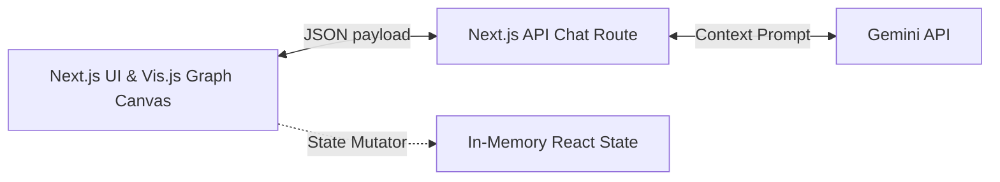

# Technical Architecture - Hackathon Edition

## Sentinel AI System Architecture

This document describes the simplified architecture for the Sentinel AI demo app.

---

## 1. Simplified System Architecture

To guarantee speed, reliability, and visual polish, the architecture is stripped of all enterprise database requirements, focusing entirely on a fast Next.js frontend, client-side graph layouts, and live Gemini API stream orchestration.

---

## 2. Component Design

### Frontend (Single-Page React App)
* **Triage List:** Sidebar containing the primary investigation target alert card (`alert-1042`).
* **Visual Graph Canvas (vis-network / React Flow):** Renders the pre-defined 5-node romance scam ring. Displays money flows dynamically.
* **Timeline Widget:** Displays a static chronological sequence of events (cyber notice, transfers, IP change).
* **Copilot Drawer:** Sidebar chat box that calls the Gemini endpoint and streams markdown responses. Contains helper action prompts (e.g., "Draft SAR").
* **Action Header:** Action button group ("Freeze Account & Network") that triggers a state update turning the target graph nodes red.

### Backend API Routes
* `/api/chat`: Streams prompts to the Gemini API (`gemini-2.5-flash` or similar) along with the structured text representation of our single pre-baked scenario ledger.

---

## 3. Technology Stack & Packages

| Layer | Technology | Rationale |
|---|---|---|
| **Framework** | Next.js (App Router, TS) | Immediate workspace setup. |
| **Styling** | Tailwind CSS & CSS Variables | Fast dark-mode layout implementation. |
| **Graph Render** | vis-network | Client-side Canvas rendering. Highly customizable node colors and edge weights. |
| **AI Integration** | Google Gen AI SDK (`@google/genai`) | Lightweight client SDK for streaming chatbot responses. |
| **Icons** | Lucide React | Clean UI iconography. |
| **State** | React Context / useState | Fully in-memory state. No complex DB setups needed to show actions. |
