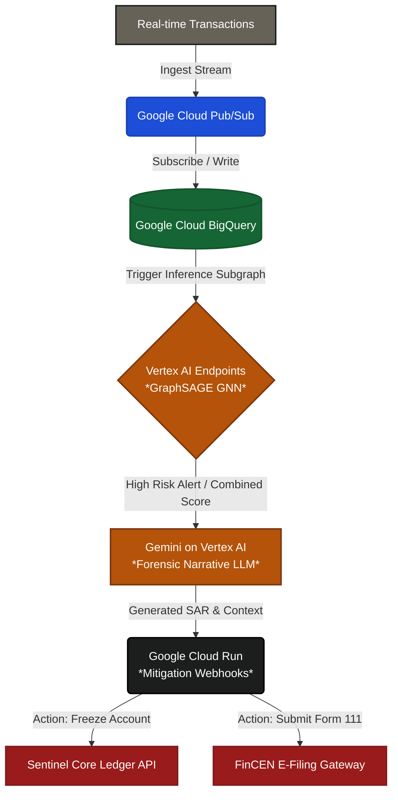

# Google Cloud Reference Architecture: Sentinel AI

> [!IMPORTANT]
> **Status: Documented-Not-Deployed**
> This architecture is documented for judging purposes. It has not been deployed. The live demo runs on a local FastAPI + Next.js stack, described separately.

This document outlines the target-state cloud architecture for scaling Sentinel AI into a production-grade, Google Cloud-native financial intelligence platform.

---

## 1. System Architecture Flow

The following diagram illustrates the proposed transaction ingestion, evaluation, explanation, and mitigation pipeline.

---

## 2. Component Analysis

### Google Cloud Pub/Sub (Transaction Ingestion)
*   **Role in Architecture**: Serves as the high-throughput entry point for transaction streaming. Financial institutions stream ledger events directly to a `transactions-inbound` topic.
*   **Why GCP-Native**: Provides global, asynchronous message queues with low-latency pub/sub semantics. In the local mock stack, ingestion is simulated via static array transitions. Pub/Sub handles backpressure and decouples ingestion from graph traversal.

### Google Cloud BigQuery (Storage & Warehouse)
*   **Role in Architecture**: Serves as both the permanent historical database and the analytical store. Transactions are logged into partitioned tables, and subgraphs are dynamically extracted via SQL queries or BigQuery ML graph routines.
*   **Why GCP-Native**: Eliminates the overhead of managing relational databases at petabyte scale. In the local demo, the system queries in-memory JSON data. In production, BigQuery functions as a high-performance feature store for retrieving node/edge lists.

### Vertex AI Endpoints (GraphSAGE GNN Serving)
*   **Role in Architecture**: Hosts the trained GraphSAGE model. An endpoint takes a dynamic subgraph (nodes representing target accounts, edges representing transfer channels) and returns an anomaly probability.
*   **Why GCP-Native**: Vertex AI Model Registry and Endpoints replace the current standalone FastAPI service. It handles GPU scaling, auto-provisioning, versioning, and canary deployments natively, ensuring consistent inference times as graph density increases.

### Gemini on Vertex AI (Forensic Narrative LLM)
*   **Role in Architecture**: Orchestrates the automated drafting of the Suspicious Activity Report (SAR) by processing GNN anomaly weights, raw transaction logs, and rule-check flags.
*   **Why GCP-Native**: Replaces the direct Gemini SDK client call. Using Vertex AI allows enterprise controls, data residency constraints, fixed-rate provisioning, and private grounding (RAG) using BigQuery vector search data without leaking financial data to public APIs.

### Google Cloud Run (Mitigation Webhooks)
*   **Role in Architecture**: Hosts serverless, stateless webhook routines. When Vertex AI flags an account and Gemini generates the report, Cloud Run handles the dispatch of isolation requests (ledger freezes) and the FinCEN payload submission.
*   **Why GCP-Native**: Replaces local Next.js API routes with scale-to-zero compute containers. It ensures sandbox boundary safety and handles retries, webhook timeouts, and rate limits when communicating with legacy banking APIs.

---

## 3. Proposed Migration Path

Transitioning the current local FastAPI + Next.js stack to this native GCP architecture requires a structured, multi-phase migration:

1.  **Phase 1: Ingestion & Data Warehousing (Estimated: 2 weeks)**
    *   Set up Pub/Sub topics.
    *   Create BigQuery datasets matching the transaction schema in `src/lib/mockData.ts`.
    *   Deploy a simple Dataflow pipeline to stream incoming Pub/Sub transactions straight into BigQuery.
2.  **Phase 2: Vertex AI Model Migration (Estimated: 3 weeks)**
    *   Export the PyTorch Geometric GraphSAGE model (`models/graphsage_amlsim_v2.pt`).
    *   Build a custom serving container utilizing Triton Inference Server or TorchScript.
    *   Deploy and register the container onto a Vertex AI Endpoint with GPU acceleration.
3.  **Phase 3: Compute & LLM Integration (Estimated: 2 weeks)**
    *   Deploy the Next.js frontend to Cloud Run.
    *   Convert Next.js API routes (`src/app/api/ml-score/route.ts` and `src/app/api/chat/route.ts`) to use Vertex AI SDKs instead of direct OpenAI/Gemini generic client initializations.
    *   Configure Identity-Aware Proxy (IAP) to restrict app access to investigators.

**Total Estimated Implementation Effort**: **7 weeks** for a single senior cloud engineer to reach a stable sandbox staging environment.

---

## 4. Explicit Non-Goals

The following aspects are intentionally **out of scope** for this architectural reference document to maintain a clear focus on scale mapping:
*   **IAM & Least Privilege Policy Design**: Detailed Role-Based Access Control (RBAC) configurations between Pub/Sub, BigQuery, and Vertex AI are omitted.
*   **Cost Estimation & Capacity Planning**: Detailed monthly budget forecasts, active node sizes, and egress cost calculations are excluded.
*   **Authentication & Access Control**: The integration of Okta/Active Directory for dashboard user login is not addressed.
*   **Production Monitoring**: Setup of Cloud Logging, Cloud Monitoring, and GNN performance drift tracking is deferred.
